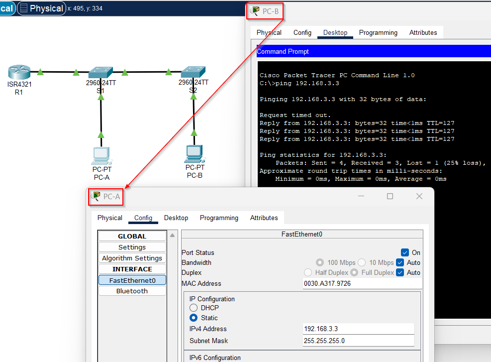
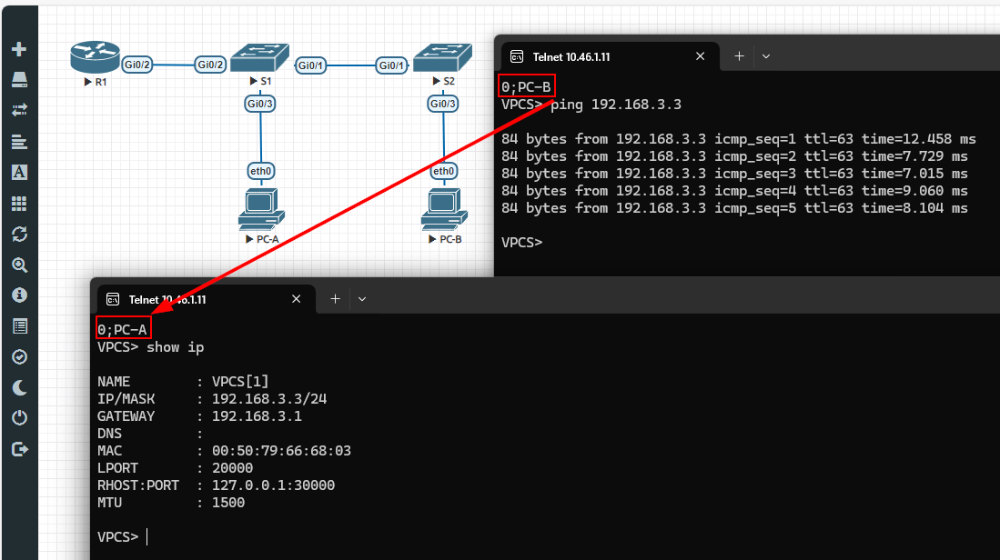

## Общая задача "научиться работать с VLAN"
> В материалах курса представлена вся необходимая инфа (ну почти).

> Если нет опыта работы cisco-console или лабораторной среде, то придётся дополнительно ~~гуглить~~ яндексить по элементарным вопросам.

В исследовательских целях, выполнил работу как в CiscoPacketTracer (далее CPT), так и в EVE-NG (далее EVE).

#### Работа в CPT:
1. Сохранённая в виде файла, схема [PCP-Lesson2-VLAN.zip](PCP-Lesson2-VLAN.zip) в CPT
2. Отдельно конфиг роутера [R1_running-config.txt](R1_running-config.txt)
3. Отдельно конфиг свича1 [S1_running-config.txt](S1_running-config.txt)
4. Отдельно конфиг свича2 [S2_running-config.txt](S2_running-config.txt)
5. Конфиги компьютеров выгрузить не смог, но там просто адресация для пинга.
6. В результате применения упомянутых конфигов, получается рабочий пинг:

#### Работа в EVE:
1. Сохранённая в виде файла, схема [EVE-Lesson-2.zip](EVE-Lesson-2.zip) в EVE
2. Отдельно конфиг роутера [R1.txt](R1.txt)
3. Отдельно конфиг свича1 [S1.txt](S1.txt)
4. Отдельно конфиг свича2 [S2.txt](S2.txt)
5. Отдельно конфиг компьютера-А [PC-A.txt](PC-A.txt)
6. Отдельно конфиг компьютера-B [PC-B.txt](PC-B.txt)

---
### Любопытные моменты
* Потратил наверное часа 2-3 на отладку схемы в CPT что бы заработал ping, т.к. не знал, что нужно было нажать простую кнопку **REALTIME** что бы трафик в схеме работал и пинг ходил -_-
* Почувствовал отличие OS в устройствах CPT и EVE, т.к. заработавшую схему в CPT, что бы запустить в EVE, потратил ещё часа наверное 2, т.е. в EVE пришлось дополнительно включать инкапсуляцию dot1Q, что уже нативно работает в CPT -_-
* в образе IOL в EVE, выбирая switch L2, появляется устрйоство L3, у него интерфейсоф да же всего 4, пришлось совмещать образы IOL с vIOS, это не проблема для текущего ДЗ, но в перспективе не хорошо (возможно пока в чём-то просто не разобрался).
* На знакомство связки VS-Code + git + github, а так же оформления текущего ДЗ сожглось навреное часов 3-5 (неожиданно много).