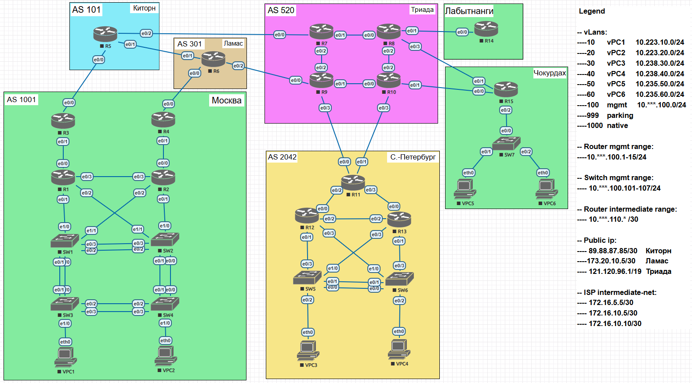
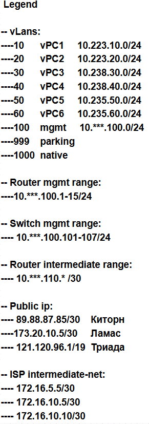

Работа не очень сложная, но довольно объёмная. 
Базовую схему инфры OTUS 
1. Не много скорректировал\выровнял\переименовал
2. Запланировал адресное пространство всей схемы
3. Не много перекоммутировал (упростил\усложнил) и добавил легенду
4. Вайпнул все устройства.

 Начну подготовку устройств.
 Придерживаюсь подхода "по минимуму"

 Базовый элемент для всех устройств 


## Общая задача "Запланироватьи подготовить сетевую инфраструктуру"
> _В проведённом занятии и материалах курса представлена вся необходимая инфа._

> _Будем в целом шагать по методичке, хотя и с отклонениями, ввиду особенностей Образов eve и своим виденинием как было бы лучше._
#### Работа в EVE:
##### Часть1. Подготовка среды:
1. Создал лабу Less11. Разместил схему предоставленную OTUS'ом иотредачил многие моменты. Всё вайпнул.

Схема в итоге, получилась такой




Далее распишем в виде таблицы, всё адресное пространство инфраструктуры и на каких портах какие адреса.
Решил что будет пара офисов, несколько провайдеров и пара филиалов. Так проще воспринимать то почему такая разница в конфигурациях в разных локациях.
Так же уточню, что для межпровайдерского взаимодействия, выделил отдельную сеть, якобы между провайдерами применяется interconnect или подобные решения для более оптимальной связи друг с другом.

Так же приведу отдельно легенду по адресации:



### **Офисы :** 


- **Москва**

Network 10.223.0.0/16 (prefix 10.192.0.0/11)
| Device     | Interface | Address           | Description     | Etherchannel |
| ---- | ---- | ---- | ---- | ---- |
|  |  |  |  |  |
| R1         | e0/0 | 10.223.1.2/30      | R3 e0/0 msk    |     |
|            | e0/1 |   | S1 e1/0 msk    |     |
|            | e0/1.10 | 10.223.10.2/24  | S1 e1/0 msk    |     |
|            | e0/1.20 |   | S1 e1/0 msk |     |
|            | e0/1.30 |   | S1 e1/0 msk |     |
|            | e0/1.40 |   | S1 e1/0 msk |     |
|            | e0/1.50 |   | S1 e1/0 msk |     |
|            | e0/1.60 |   | S1 e1/0 msk |     |
|            | e0/1.100 | 10.223.100.11/24| S1 e1/0 msk   |     |
|            | e0/1.1000 | | S1 e1/0 msk |     |
|            | e0/2 |   | S2 e1/1 msk    |     |
|            | e0/2.10 |   | S2 e1/1 msk |     |
|            | e0/2.20 | 10.223.20.2/24  | S2 e1/1 msk    |     |
|            | e0/2.30 |   | S2 e1/1 msk |     |
|            | e0/2.40 |   | S2 e1/1 msk |     |
|            | e0/2.50 |   | S2 e1/1 msk |     |
|            | e0/2.60 |   | S2 e1/1 msk |     |
|            | e0/2.100 |  | S2 e1/1 msk |     |
|            | e0/2.1000 | | S2 e1/1 msk |     |
|            | e0/3 | 10.223.110.1/30  | R2 e0/3 msk      |     |
|  |  |  |  |  |
| R2         | e0/0 | 10.223.2.2/30      | R4 e0/0 msk    |     |
|            | e0/1 |   | S2 e1/0 msk    |     |
|            | e0/1.10 | 10.223.10.3/24  | S2 e1/0 msk    |     |
|            | e0/1.20 |   | S2 e1/0 msk |     |
|            | e0/1.30 |   | S2 e1/0 msk |     |
|            | e0/1.40 |   | S2 e1/0 msk |     |
|            | e0/1.50 |   | S2 e1/0 msk |     |
|            | e0/1.60 |   | S2 e1/0 msk |     |
|            | e0/1.100 | 10.223.100.12/24| S2 e1/0 msk   |     |
|            | e0/1.1000 | | S2 e1/0 msk |     |
|            | e0/2 |   | S1 e1/1 msk    |     |
|            | e0/2.10 |   | S1 e1/1 msk |     |
|            | e0/2.20 | 10.223.20.2/24  | S1 e1/1 msk    |     |
|            | e0/2.30 |   | S1 e1/1 msk |     |
|            | e0/2.40 |   | S1 e1/1 msk |     |
|            | e0/2.50 |   | S1 e1/1 msk |     |
|            | e0/2.60 |   | S1 e1/1 msk |     |
|            | e0/2.100 |  | S1 e1/1 msk |     |
|            | e0/2.1000 | | S1 e1/1 msk |     |
|            | e0/3 | 10.223.110.2/30  | R1 e0/3 msk      |     |
|  |  |  |  |  |
| R3         | e0/0 | 89.88.87.85/30  | R5 e0/0 kitorn    |     |
|            | e0/1 |  10.223.1.1/30 | R1 e0/0 msk        |     |
|            | e0/1.10 |   | R1 e0/0 msk                  |     |
|            | e0/1.20 |   | R1 e0/0 msk                  |     |
|            | e0/1.30 |   | R1 e0/0 msk                  |     |
|            | e0/1.40 |   | R1 e0/0 msk                  |     |
|            | e0/1.50 |   | R1 e0/0 msk                  |     |
|            | e0/1.60 |   | R1 e0/0 msk |     |
|            | e0/1.100 | 10.223.100.13/24| R1 e0/0 msk   |     |
|            | e0/1.1000 | | R1 e0/0 msk |     |
|  |  |  |  |  |
| R4         | e0/0 | 173.20.10.5/30  | R6 e0/0 lamas     |     |
|            | e0/1 | 10.223.2.1/30  | R2 e0/0 msk        |     |
|            | e0/1.10 |   | R2 e0/0 msk     |     |
|            | e0/1.20 |   | R2 e0/0 msk |     |
|            | e0/1.30 |   | R2 e0/0 msk |     |
|            | e0/1.40 |   | R2 e0/0 msk |     |
|            | e0/1.50 |   | R2 e0/0 msk |     |
|            | e0/1.60 |   | R2 e0/0 msk |     |
|            | e0/1.100 | 10.223.100.14/24| R2 e0/0 msk   |     |
|            | e0/1.1000 | | R2 e0/0 msk |     |
|  |  |  |  |  |
| S1         | e0/0 |   | S3 e0/0 msk     | po1 |
|            | e0/1 |   | S3 e0/1 msk     | po1 |
|            | e0/2 |   | S2 e0/2 msk     | po2 |
|            | e0/3 |   | S2 e0/3 msk     | po2 |
|            | e1/0 |   | R1 e0/1 msk     |     |
|            | e1/1 |   | R2 e0/2 msk     |     |
|            |vlan100| 10.223.100.101/24| svi mgmt-device |     |
|  |  |  | |  |
| S2         | e0/0 |   | S4 e0/0 msk     | po1 |
|            | e0/1 |   | S4 e0/1 msk     | po1 |
|            | e0/2 |   | S1 e0/2 msk     | po2 |
|            | e0/3 |   | S1 e0/3 msk     | po2 |
|            | e1/0 |   | R2 e0/1 msk     |     |
|            | e1/1 |   | R1 e0/2 msk     |     |
|            |vlan100| 10.223.100.102/24| svi mgmt-device |     |
|  |  |  |  |  |
| S3         | e0/0 |   | S1 e0/0 msk     | po1 |
|            | e0/1 |   | S1 e0/1 msk     | po1 |
|            | e0/2 |   | S4 e0/2 msk     | po2 |
|            | e0/3 |   | S4 e0/3 msk     | po2 |
|            | e1/0 |   | vPC1 e0/0 msk   |     |
|            |vlan100| 10.223.100.103/24| svi mgmt-device |     |
|  | |  |  |  |
| S4         | e0/0 |   | S2 e0/0 msk     | po1 |
|            | e0/1 |   | S2 e0/1 msk     | po1 |
|            | e0/2 |   | S3 e0/2 msk     | po2 |
|            | e0/3 |   | S3 e0/3 msk     | po2 |
|            | e1/0 |   | vPC2 e0/0 msk   |     |
|            |vlan100| 10.223.100.104/24| svi mgmt-device |     |
|  | |  |  |  |
| vPC1       | e0/0 | 10.223.10.5/24  | S3 e1/0 msk     |     |
|  |  |  |  |  |
| vPC2       | e0/0 | 10.223.20.5/24  | S4 e1/0 msk     |     |
|  |  |  |  |  |


- **Петербург**


Network 10.238.0.0/16
| Device     | Interface | Address           | Description     | Etherchannel |
| ---- | ---- | ---- | ---- | ---- |
|  |  |  |  |  |
| R11        | e0/0 | 121.120.119.102/30  | R9 e0/3 triada |     |
|            | e0/1 | 121.120.119.106/30  | R10 e0/3 triada|     |
|            | e0/2 |  10.238.1.1/30 | R12 e0/0 spb        |     |
|            | e0/2.10 |   | R12 e0/0 spb                  |     |
|            | e0/2.20 |   | R12 e0/0 spb                  |     |
|            | e0/2.30 |   | R12 e0/0 spb                  |     |
|            | e0/2.40 |   | R12 e0/0 spb                  |     |
|            | e0/2.50 |   | R12 e0/0 spb                  |     |
|            | e0/2.60 |   | R12 e0/0 spb                  |     |
|            | e0/2.100 | 10.238.100.21/24| R12 e0/0 spb   |     |
|            | e0/2.1000 | | R12 e0/0 spb                  |     |
|            | e0/3 |  10.238.2.1/30 | R13 e0/0 spb        |     |
|            | e0/3.10 |   | R13 e0/0 spb                  |     |
|            | e0/3.20 |   | R13 e0/0 spb                  |     |
|            | e0/3.30 |   | R13 e0/0 spb                  |     |
|            | e0/3.40 |   | R13 e0/0 spb                  |     |
|            | e0/3.50 |   | R13 e0/0 spb                  |     |
|            | e0/3.60 |   | R13 e0/0 spb                  |     |
|            | e0/3.100 |  | R13 e0/0 spb                  |     |
|            | e0/3.1000 | | R13 e0/0 spb                  |     |
|  |  |  |  |  |
| R12        | e0/0 | 10.238.1.2/30      | R11 e0/2 spb    |     |
|            | e0/1 |   | S5 e0/3 spb    |     |
|            | e0/1.10 |   | S5 e0/3 spb    |     |
|            | e0/1.20 |   | S5 e0/3 spb |     |
|            | e0/1.30 | 10.238.30.1/24  | S5 e1/0 spb |     |
|            | e0/1.40 |   | S5 e0/3 spb |     |
|            | e0/1.50 |   | S5 e0/3 spb |     |
|            | e0/1.60 |   | S5 e0/3 spb |     |
|            | e0/1.100 | 10.238.100.22/24| S5 e1/0 spb   |     |
|            | e0/1.1000 | | S5 e0/3 spb |     |
|            | e0/2 | 10.238.110.1/30  | R13 e0/2 spb      |     |
|            | e0/3 |   | S6 e1/0 spb    |     |
|            | e0/3.10 |   | S6 e1/0 spb |     |
|            | e0/3.20 |   | S6 e1/0 spb    |     |
|            | e0/3.30 |   | S6 e1/0 spb |     |
|            | e0/3.40 | 10.238.40.2/24  | S6 e1/0 spb |     |
|            | e0/3.50 |   | S6 e1/0 spb |     |
|            | e0/3.60 |   | S6 e1/0 spb |     |
|            | e0/3.100 |  | S6 e1/0 spb |     |
|            | e0/3.1000 | | S6 e1/0 spb |     |
|  |  |  |  |  |
| R13        | e0/0 | 10.238.2.2/30      | R11 e0/3 spb    |     |
|            | e0/1 |   | S6 e0/3 spb    |     |
|            | e0/1.10 |   | S6 e0/3 spb    |     |
|            | e0/1.20 |   | S6 e0/3 spb |     |
|            | e0/1.30 | 10.238.30.2/24  | S6 e0/3 spb |     |
|            | e0/1.40 |   | S6 e0/3 spb |     |
|            | e0/1.50 |   | S6 e0/3 spb |     |
|            | e0/1.60 |   | S6 e0/3 spb |     |
|            | e0/1.100 | 10.238.100.23/24| S6 e1/0 spb   |     |
|            | e0/1.1000 | | S6 e0/3 spb |     |
|            | e0/2 | 10.238.110.2/30  | R12 e0/2 spb      |     |
|            | e0/3 |   | S5 e1/0 spb    |     |
|            | e0/3.10 |   | S5 e1/0 spb |     |
|            | e0/3.20 |   | S5 e1/0 spb    |     |
|            | e0/3.30 |   | S5 e1/0 spb |     |
|            | e0/3.40 | 10.238.40.1/24  | S5 e1/0 spb |     |
|            | e0/3.50 |   | S5 e1/0 spb |     |
|            | e0/3.60 |   | S5 e1/0 spb |     |
|            | e0/3.100 |  | S5 e1/0 spb |     |
|            | e0/3.1000 | | S5 e1/0 spb |     |
|  |  |  |  |  |
| S5         | e0/0 |   | S6 e0/0 spb     | po1 |
|            | e0/1 |   | S6 e0/1 spb     | po1 |
|            | e0/2 |   | vPC3 e0/0 spb   |     |
|            | e0/3 |   | R12 e0/1 spb    |     |
|            | e1/0 |   | R13 e0/3 spb   |     |
|            |vlan100| 10.238.100.105/24| svi mgmt-device |     |
|  |  |  | |  |
| S6         | e0/0 |   | S5 e0/0 spb     | po1 |
|            | e0/1 |   | S5 e0/1 spb     | po1 |
|            | e0/2 |   | vPC4 e0/0 spb   |     |
|            | e0/3 |   | R13 e0/1 spb    |     |
|            | e1/0 |   | R12 e0/3 spb    |     |
|            |vlan100| 10.238.100.105/24| svi mgmt-device |     |
|  | |  |  |  |
| vPC3       | e0/0 | 10.238.30.5/24  | S5 e0/2 spb     |     |
|  |  |  |  |  |
| vPC4       | e0/0 | 10.238.30.5/24  | S6 e0/2 spb     |     |
|  |  |  |  |  |


### **Провайдеры (ISP) :** 

- **Китрон**

Network 10.226.0.0/16
| Device     | Port | Address           | Description     |
| ---------- | ---- | ----------------- | --------------- |
| R5         | e0/0 | 89.88.87.86/30  | R3 e0/0 msk        |
|            | e0/1 | 172.16.5.5/30   | R6 e0/1 lamas      |
|            | e0/2 | 172.16.10.5/30  | R7 e0/0 triada     |
|            |vlan100| 10.226.100.22/24| svi mgmt-device |     |

- **Ламас**

Network 10.225.0.0/16
| Device     | Port | Address           | Description     |
| ---------- | ---- | ----------------- | --------------- |
| R6         | e0/0 | 173.20.10.6/30  | R4 e0/0 msk        |
|            | e0/1 | 172.16.5.6/30   | R5 e0/1 kitorn     |
|            | e0/2 | 172.16.10.9/30  | R9 e0/0 triada     |
|            |vlan100| 10.225.100.21/24| svi mgmt-device |     |

- **Триада**

Network 10.230.0.0/16
| Device     | Port | Address           | Description     |
| ---------- | ---- | ----------------- | --------------- |
| R7         | e0/0 | 172.16.10.6/30    | R5 e0/2 kitorn     |
|            | e0/1 | 10.230.1.1/29     | R8 e0/0 triada     |
|            | e0/2 | 10.230.2.1/29     | R9 e0/2 triada     |
|            |vlan100| 10.230.100.23/24 | svi mgmt-device |     |
|  |  |  |  |  |
| R9         | e0/0 | 172.16.10.9/30    | R6 e0/2 lamas      |
|            | e0/1 | 10.230.3.1/29     | R10 e0/3 triada    |
|            | e0/2 | 10.230.2.2/29     | R7 e0/2 triada     |
|            | e0/3 | 121.120.119.101/30| R11 e0/0 spb       |
|            |vlan100| 10.230.100.24/24 | svi mgmt-device |     |
|  |  |  |  |  |
| R8         | e0/0 | 10.230.1.2/29     | R7 e0/1 triada     |
|            | e0/1 | 121.120.100.85/30 | R14 e0/0 labitnagi |
|            | e0/2 | 10.230.4.1/29     | R10 e0/2 triada    |
|            | e0/3 | 121.120.100.81/30 | R15 e0/1 chukordah |
|            |vlan100| 10.230.100.25/24 | svi mgmt-device |     |
|  |  |  |  |  |
| R10        | e0/0 | 10.230.3.2/29     | R9 e0/1 triada     |
|            | e0/1 | 121.120.110.61/30 | R15 e0/0 chukordah |
|            | e0/2 | 10.230.4.2/29     | R8 e0/2 triada     |
|            | e0/3 | 121.120.119.105/30| R11 e0/1 spb       |
|            |vlan100| 10.230.100.26/24 | svi mgmt-device |     |


### **Филиалы :** 

- **Лабытнаги**

Network 10.240.0.0/16
| Device     | Port | Address           | Description     |
| ---------- | ---- | ----------------- | --------------- |
| R14        | e0/0 | 121.120.100.86/30 | R8 e0/1 triada  |
|            |vlan100| 10.240.100.27/24 | svi mgmt-device |

- **Чохурдах**

Network 10.235.0.0/16
| Device     | Port | Address           | Description     |
| ---------- | ---- | ----------------- | --------------- |
| R15        | e0/0 | 121.120.110.62/30 | R10 e0/1 triada |
|            | e0/1 | 121.120.100.82/30 | R8 e0/3 triada  |
|            | e0/2 |   | S7 e0/0 chukordah    |     |
|            | e0/2.10 |   | S7 e0/0 chukordah |     |
|            | e0/2.20 |   | S7 e0/0 chukordah    |     |
|            | e0/2.30 |   | S7 e0/0 chukordah |     |
|            | e0/2.40 |   | S7 e0/0 chukordah |     |
|            | e0/2.50 | 10.235.50.1/24  | S7 e0/0 chukordah |     |
|            | e0/2.60 | 10.235.60.1/24  | S7 e0/0 chukordah |     |
|            | e0/2.100 |  | S7 e0/0 chukordah |     |
|            | e0/2.1000 | | S7 e0/0 chukordah |     |
|            |vlan100| 10.235.100.28/24 | svi mgmt-device |
|  |  |  |  |  |
| S7         | e0/0 |   | R15 e0/2 chukordah    |  |
|            | e0/1 |   | vPC5 e0/0 chukordah   |  |
|            | e0/2 |   | vPC6 e0/0 chukordah   |  |
|            |vlan100| 10.238.100.107/24| svi mgmt-device |     |
|  | |  |  |  |
| vPC5       | e0/0 | 10.235.50.5/24  | S7 e0/1 chukordah     |     |
|  |  |  |  |  |
| vPC6       | e0/0 | 10.235.60.5/24  | S7 e0/2 chukordah     |     |
|  |  |  |  |  |


Поскольку на текущий момент (11 занятие) инамической маршрутизации не изучали, то на всех устройствах пок предполагается только "статика", не вижу описывать её всё руками пока это не требуется.

Назначиение адресов клиентам по DHCP вижу смысл только для конечных устройств (vPC) для удобства пользователей.
Во остальных участках инфраструктуры, статическое назначение адресов для надёжности, которое выполняется либо командами для физ.интерфейсов
```
en
conf t
int gi0/1
ip address IP MSK
```
где ip и маска выбирается в соответствии с таблицей выше для каждого устройства не vPС.
допустим для R1:
```
en
conf t
int gi0/3
ip address 10.223.110.1 255.255.255.252
no sh
end
wr
```

Аналогично делаем для sub-nterface, в соответствии с требованиями по VLAN, HSRP если в том же R1:
```
en
conf t
int et0/1.10
encapsulation dot1q 10
ip address 10.223.10.2 255.255.255.0
standby version 2
standby 10 ip 10.223.10.1
standby 10 priority 150
standby 10 track 10 shut
standby 10 preempt
no shut
int gi0/1.100
description mgmt-svi
ip address 10.223.110.1 255.255.255.252
no sh
switchport mode access
switchport access vlan 100
end
wr
```
и далее по остальным VLAN и Ethernet аналогично грубо говоря.


В случае если как на SW1 мы строим агрегированные соединения, то как делали в предыдущих занятиях:

```
en
conf t
int port-channel1
exit

conf t
int e0/0
channel-group 1 mode active
no shut
exit

conf t
int e0/1
channel-group 1 mode active
no shut
exit

conf t
interface port-channel1
description AE1_to_SW2
switchport mode trunk
switchport trunk allowed vlan 10,20,30,40,50,60,100,1000
no shut
end
wr
```

Ну а в случае с mgmt-vlan для доступа к устройствам, вешаем адреса на vlan 100 для каждого устрйоства. 
На примере того же R1 если:

```
int vlan 100
ip address 10.223.100.11 255.255.255.0
no shut
exit
```

Далее применяя данный подход, раскидываем все адреса по всем портам всех устройств кроме vPC, т.к. они в сво очередь, получают адреса по dhcp. В случае с офисом "Москва" к примеру, на роутере R1 или R2, DHCP сервер имеет следующую конфигурацию.

```
conf t
ip dhcp excluded-address 10.223.10.1 10.223.10.4
ip dhcp excluded-address 10.223.10.254
ip dhcp pool vlan10
network 10.223.10.0 255.255.255.0
default-router 10.223.10.1
dns-server 77.88.8.8
lease 2 12 30
end
wr
```
Ну а непосредственно на клиентах (vPC) разумеется просто включено автоматическое получение ip, где череp свичи SW3 и SW1 получит свой ip от R1где настроен DHCP.


### **Конец описания** 


