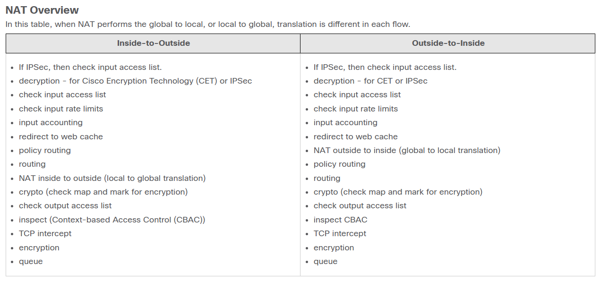

### Занятие 12.
Тема "Маршрутизация на основе политик (PBR)"

* 
* 

PBR локальный для конкретного роутера.

В [этом разделе cisco](https://www.cisco.com/c/en/us/support/docs/ip/network-address-translation-nat/6209-5.html) 
описано в какой последовательности отрабатывается трафик в системе (по крайней мере cisco)


А [в этом разделе](https://www.cisco.com/c/en/us/td/docs/ios-xml/ios/ipsla/configuration/15-mt/sla-15-mt-book/sla_udp_jitter_voip.html) описана технология IPSLA. Основная задумка которой, проверять доступность и принимать решение на основе результата.
Тема довольно обширная.

Допустим такие приёмы Ip route 4.4.4.4 255.255.255.255 50.0.0.2 track 7 (удобно когда несколько провайдеров к примеру)
или
Ip route 4.4.4.4 255.255.255.255 50.0.0.0 20 (20 это АД, правда пишется в консоле что это метрика якобы, но это АД) 
(Floating, плавающий маршрут, для автоудаления маршрута, для провайдеров к примеру) ip route сеть маска некст хоп АД
сет айпи некст-хоп 50.0.0.2 (что бы сделать рекурсивный роутинг) это если хочу отправить пакет через какой-то конкретный адрес например.


Пример конфигурации технологии
 ```
 ip sla 50
 udp-jitter 4.4.4.4 63458 source-ip 1.1.1.1 codec g711ulaw
  tag IP SLA FROM R1 TO R4
  threshold 100
ip sla schedule 50 life forever start-time now
ip sla reaction-configuration 50 react icpif threshold-value 6 5 threshold-type average 2 action-type trapOnly
ip sla logging traps
```

Или ещё
```
event manager applet ICPIF_exeeded authorization bypass
 event syslog pattern "IP.SLAs.50.: Threshold exceeded for icpif"
 action 1.0 cli command "enable"
 action 2.0 cli command "configure terminal"
 action 3.0 cli command "interface Gi2"
 action 4.0 cli command "shutdown"
 ```

Ещё как альтернатива, кратко хорошо описано про IPSLA [тут](https://networklessons.com/cisco/ccie-routing-switching-written/reliable-pbr-with-ip-sla)
Но т.к. не доступно без подписки, коллега с подпиской повомг выгрузить  + про IPSLA EEM script описывалось [тут](https://networklessons.com/cisco/ccie-routing-switching-written/ip-sla-eem-script) c 

Аналогично про PBR [тут](https://networklessons.com/ip-routing/how-to-configure-policy-based-routing) что так же в виде файлика имеется 

Так же обсуждали маршрутизацию с использованием DevNull (null0), так же пользовались разделом 

