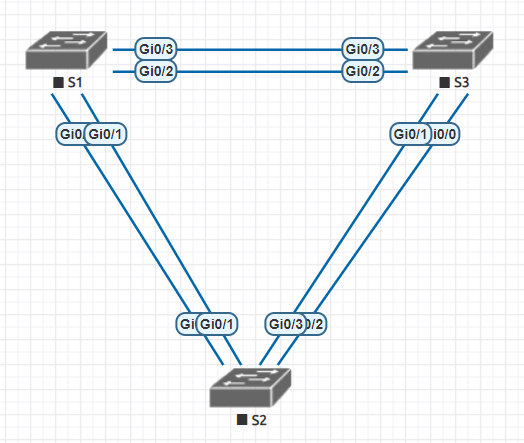
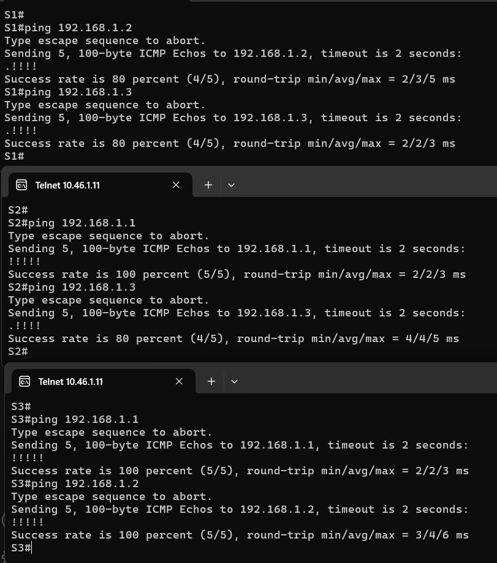
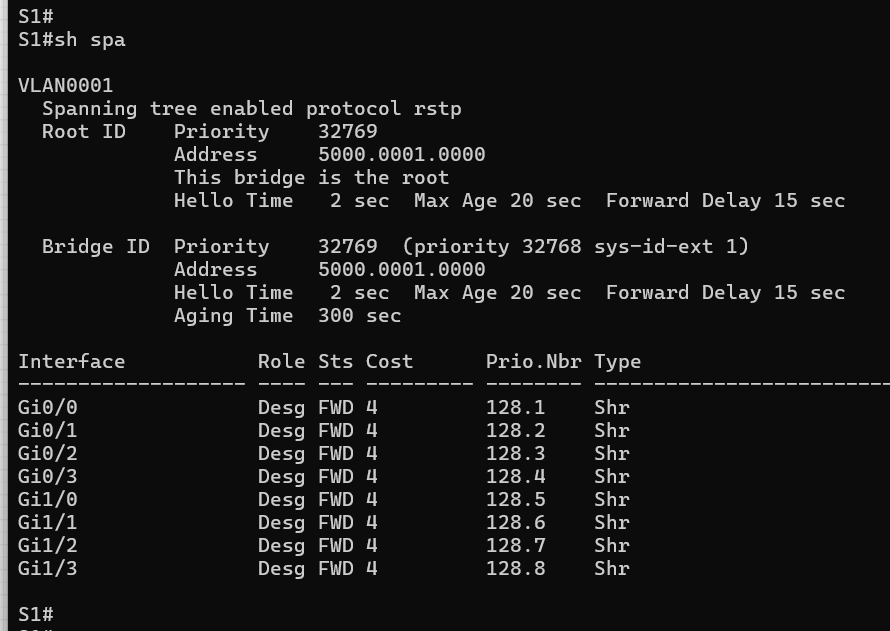
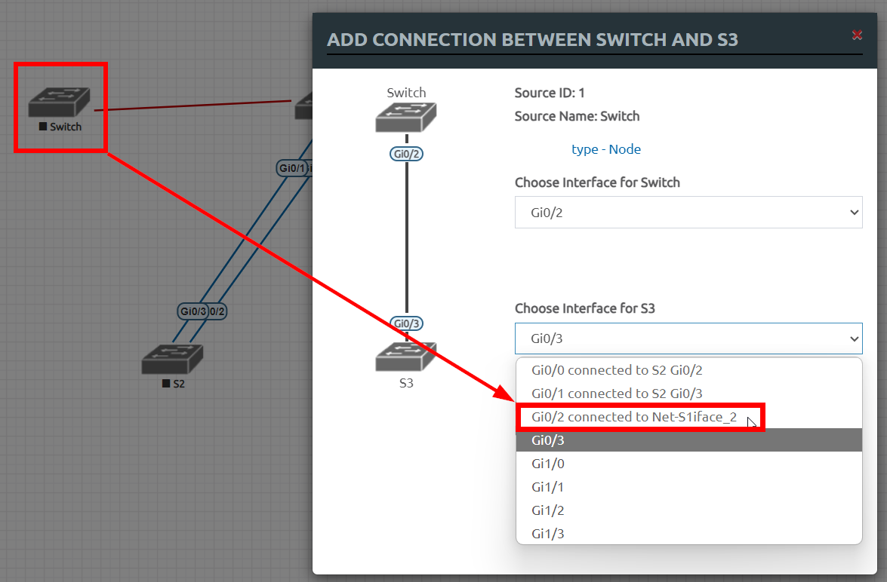

## Общая задача "научиться настраивать и отлаживать работу STP"
> _В проведённом занятии и материалах курса представлена вся необходимая инфа._

> _Будем придерживаться работы методички с мелкими отклонениями (порты несколько не совпадают в виду особенностей образа vIOS в EVE)_
#### Работа в EVE:
##### Часть1. Подготовка среды:
1. Создал лабу Less3. Разместил, переименовал и вайпнул 3шт vIOS-switch.
2. Скоммутировал свичи, но отлично от методичного варианта, что бы все коннекты были в первой группе 4-х портов (gi0/0-3)

3. Предварительная настройка всех свичей идентична друг-другу в рамках задачи, отличаются лишь "hostname", "mgmt-ip" и "description-ports".

Покомандно, конфигурация свичей будет выполняться так (можно прям crl+c ->  ctrl+v)

Первый свич S1
```
S1> 
enable
conf t

hostname S1

no ip domain-lookup
line console 0
password cisco
login
logging synchronous
exit
line vty 0 4
password cisco
login
logging synchronous
exit
enable password class
no banner login
no banner incoming
no banner exec
banner login #
This system is intended for Oscorp users only.
Any person using this system gives explicit consent 
that the login attempt has already been reflected in the 
logs and will be transferred to law enforcement agencies.
#
banner exec #
Hello, behave yourself and give a full account 
of any of your actions on this device, 
otherwise NOC or ISEC Oscorp will put you on a bottle.
#
vlan 4
name operations
exit
vlan 3
name managment
exit
vlan 7
name ParkingLot
exit
vlan 8
name Native
int range gi0/0-3
switchport trunk encapsulation dot1q
switchport mode trunk
switchport trunk native vlan 8
switchport trunk allowed vlan all
exit

int vlan 1
ip address 192.168.1.1 255.255.255.0
no shut
exit

int gi0/0
description to_S2_gi0/0
no shut
exit
int gi0/1
description to_S2_gi0/1
no shut
exit
int gi0/2
description to_S3_gi0/2
no shut
exit
int gi0/3
description to_S3_gi0/3
no shut
exit

end
wr
reload

```
Далее второй свич S2
```
S2> 
enable
conf t

hostname S2

no ip domain-lookup
line console 0
password cisco
login
logging synchronous
exit
line vty 0 4
password cisco
login
logging synchronous
exit
enable password class
no banner login
no banner incoming
no banner exec
banner login #
This system is intended for Oscorp users only.
Any person using this system gives explicit consent 
that the login attempt has already been reflected in the 
logs and will be transferred to law enforcement agencies.
#
banner exec #
Hello, behave yourself and give a full account 
of any of your actions on this device, 
otherwise NOC or ISEC Oscorp will put you on a bottle.
#
vlan 4
name operations
exit
vlan 3
name managment
exit
vlan 7
name ParkingLot
exit
vlan 8
name Native
int range gi0/0-3
switchport trunk encapsulation dot1q
switchport mode trunk
switchport trunk native vlan 8
switchport trunk allowed vlan all
exit

int vlan 1
ip address 192.168.1.2 255.255.255.0
no shut
exit

int gi0/0
description to_S1_gi0/0
no shut
exit
int gi0/1
description to_S1_gi0/1
no shut
exit
int gi0/2
description to_S3_gi0/0
no shut
exit
int gi0/3
description to_S3_gi0/1
no shut
exit

end
wr
reload

```
Ну и третий свич S3
```
S3> 
enable
conf t

hostname S3

no ip domain-lookup
line console 0
password cisco
login
logging synchronous
exit
line vty 0 4
password cisco
login
logging synchronous
exit
enable password class
no banner login
no banner incoming
no banner exec
banner login #
This system is intended for Oscorp users only.
Any person using this system gives explicit consent 
that the login attempt has already been reflected in the 
logs and will be transferred to law enforcement agencies.
#
banner exec #
Hello, behave yourself and give a full account 
of any of your actions on this device, 
otherwise NOC or ISEC Oscorp will put you on a bottle.
#
vlan 4
name operations
exit
vlan 3
name managment
exit
vlan 7
name ParkingLot
exit
vlan 8
name Native
int range gi0/0-3
switchport trunk encapsulation dot1q
switchport mode trunk
switchport trunk native vlan 8
switchport trunk allowed vlan all
exit

int vlan 1
ip address 192.168.1.3 255.255.255.0
no shut
exit

int gi0/0
description to_S2_gi0/2
no shut
exit
int gi0/1
description to_S2_gi0/3
no shut
exit
int gi0/2
description to_S1_gi0/2
no shut
exit
int gi0/3
description to_S1_gi0/3
no shut
exit

end
wr
reload

```
4. Экспортировал в startup-config в eve, конфигурацию свичей.
5. На каждом свиче, пропинговал два других - всё время успех, иногда не с первого раза успех 100% (пинг такой, это бывает, норма для пинга):


##### Часть2. Определение рута:

Посмотрим какой свич корневой. Командой sh spanning-tree видим совпадение приоритета, но замечаем что mac у S1 меньше других, по этому то он и стал рутом (This bridge is the root)


выключаем на всех свичах все порты:
```
conf t
int range gi0/0-3
sh
exit
int range gi1/0-2
sh
end

```
Транки настроил ещё на этапе предварительной настройки свичей, идём дальше.

Включаем порты f0/2 и f0/4 (в моём случае будет gi0/1 и gi0/3) на всех свичах, таким образом поднимаем лишь одну линию между каждым свичём.
```
conf t
int gi0/1
no sh
exit
int gi0/3
no sh
end

```

снова смотрим sh spanning-tree и отвечаем наряд вопросов:


1. Корневым коммутатором является S1, ведь он сам об этом пишет "This bridge is the root", потому что в сумме ID+Vlan+MAC - стоимость пути к нему меньше всех (в частности благодаря MAC'у т.к. другие вышестоящие атрибуты совпадают)
2. Корневыми портами у нас являются на S2 порт Gi0/0, а на S3 порт Gi0/2.
3. Назначенными порты, на S1 все его порты, на S2 порты Gi0/2-3 и Gi1/3, а на S3 порт Gi1/3.
4. В качестве же альтернативных портов, выступают, на S2 порт Gi0/1, а на S3 это порты Gi0/0-1 и Gi0/3.
5. Почему STP выбрал именно этот порт в качестве заблокированного? STP не выбирал этот порт, а мы по сути сами это сделали, т.к. согласно методичке, с начала мы в "Часть2, Шаг1" положили все порты, за тем, в "Часть2, Шаг3" подняли только F0/2 и F0/4 (в моём случае gi0/1 и gi0/3), при этом другие порты не поднимая, соответственно у свичей и выбора то нет =)
**Однако**, если бы мы подняли и все остальные, то порты с б**О**льшим идентификатором (на участке соединения с одним соседом), т.к. приоритетнее наименьший ID, стали бы заблокированными во избежание петли.

##### Часть3. Наблюдение по стоимости портов:
> _Выбрал свич S3, т.к. до него стоимость вышла из-за более высоких идентификаторов портов у S1 в направлении к S3._

Уменьшим стоимость текущего рут-порта на S3.
```
conf t
int gi0/2
spanning-tree cost 18
end
wr

```
смотрим конфигурацию (show spanning-tree) и видим что теперь рутовый порт у S3 это Gi0/3, а то что был рутом ранее (Gi0/2) принял роль Alternate из-за коста 18, что бы не возникло петли.

Убираем внесённые изменения
```
conf t
int gi0/2
no spanning-tree cost 18
end
wr

```
и наблюдаем что Gi0/2 снова стал рутовым портом.

##### Часть4. Наблюдение по приоритету портов
теперь включим ранее-выключенные порты на всех свичах Gi0/0 и Gi0/2 (по методичке это F0/1 и F0/3)
```
conf t
int gi0/0
no sh
exit
int gi0/2
no sh
end
wr

```

смотрим (можем ожидать до 30секунд), аз тем смотрим (sh spanning-tree), где наблюдаем, что у S2 рутпорт Gi0/0, а у S3 рутпорт Gi0/2 как и было прежде =) 
Это потому что у S2 Gi0/0 с самым маленьким номером порта, а у S3 порт Gi0/2 меньше порта Gi0/3, по этому порт и не менялся, просто так совпало с моей конфигурацией сети =)

> _В общем результаты тестирования не такие красивые как предполагалось по методичке из-за того, то у меня сменились порты в угоду удобства описания в рамках одного блока номеров портов._


### Для повторения:
1. После выбора корневого свича, STP выбирает ближайший по стоимости (COST) порт до рут-свича, по алгоритму STA.
1. Если COST совпадает, STP проверяет  ID порта отправителя для выбора предпочтительного порта.
2. Ну а если ID порта отправителя совпадёт между сравниваемыми подключениями, тогда свич ориентируется на наименьший номер порта получателя(у себя).


---
### Любопытные моменты
* Для консоли, пришлось текст приветсвия корректировать, т.к. в отличие от SSH, тут проблемы с длинной строкой, текс ломается.
* Что бы в eve экспортировать конфиг свичей к примеру, нужно зайти в консоль каждого устройства, залогиниться и подняться до enable. Возможно это из-за паролей на устройства так стало.
* Неприятный недостаток. Решив пересоздать в Eve ноду S1, удалил её, сделал новую, повторяю соединение c S3, а S3 думает, что лини Gi0/2 всё ещё занята (с удалённым S1) и теперь что получается, мне надо и S3 переутснавливать?
Ла, теперь я буду с начало линки удалять, а за тем ноду. Или перезагружать лабу\сервер но это совсем не очевидно в начале =(
    