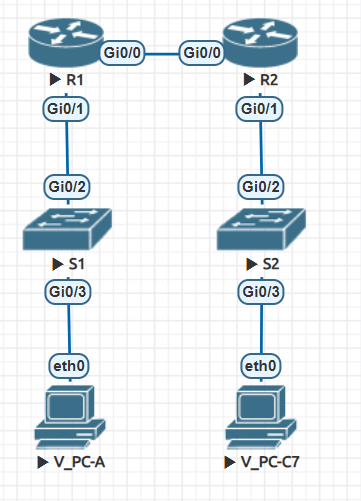
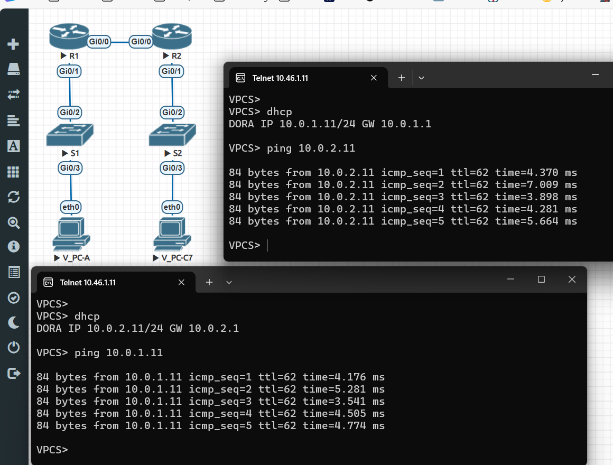
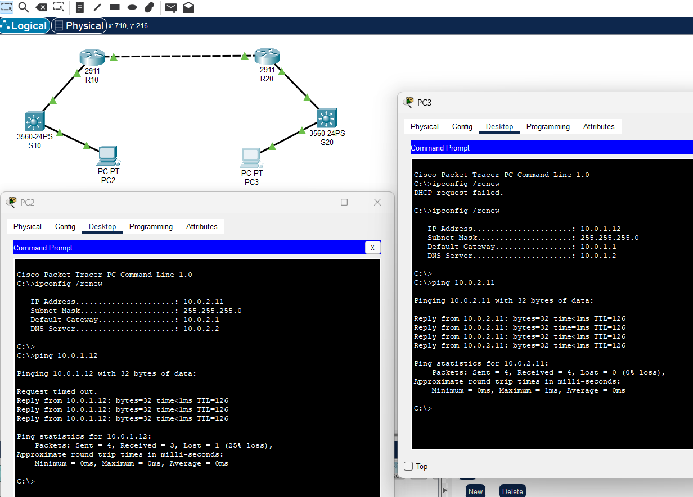

## Общая задача "научиться настраивать и отлаживать работу DHCP"
> _В проведённом занятии и материалах курса представлена вся необходимая инфа._

> _Будем придерживаться работы методички с мелкими отклонениями (порты несколько не совпадают в виду особенностей образа vIOS в EVE)_
#### Работа в EVE:
##### Часть1. Подготовка среды:
1. Создал лабу Less5. Разместил, переименовал и вайпнул 2шт vIOS-switch и 2шт vIOS-roiter
2. Скоммутировал устройства, отлично от методички из-за особенностей образов, коннекты в первой группе 4-х портов (gi0/0-3)



3. Предварительная настройка всех свичей и роутеров почти идентичны друг-другу в рамках задачи, отличаются лишь "hostname", "mgmt-ip" и "description-ports".
```
no ip domain-lookup
no logging console
line console 0
password cisco
login
logging synchronous
exit
line vty 0 4
password cisco
login
logging synchronous
exit
enable password class
```

Покомандно, конфигурация свичей c роутерами будет выполняться так (можно прям ctrl+c -> ctrl+v и работает)
`
Уточнение. Представлю две конфигурации. Для EVE и CPT, ниже поясню.
`

```
Если вкратце то далее мы:
* настроим сивичи как L2, 
* настроим DHCP-сервер на R1, 
* настроим DHCP-Relay на R2, 
* подключим пару хостов и попингуем в обе стороны.
```
### Для EVE-NG
----------------------------------------------------
Первый свич S1
```

enable
conf t

hostname S1

no ip domain-lookup
no logging console
line console 0
password cisco
login
logging synchronous
exit
line vty 0 4
password cisco
login
logging synchronous
exit
enable password class

vlan 100
name clients
exit
vlan 200
name managment
exit
vlan 999
name parking_Lot
exit
vlan 1000
name native
end

#вырубаем все порты

conf t
int range gi0/0-3
shut
exit

# теперь конфигурим только нужное

int gi0/2
description to_R1_gi0/1
switchport trunk encapsulation dot1q
switchport mode trunk
switchport trunk native vlan 1000
switchport trunk allowed vlan 100,200,999,1000
no shut
end

conf t
int gi0/3
description to_PC-A_eth0
switchport mode access
switchport access vlan 200
spanning-tree portfast
no shut
exit


```


----------------------------------------------------
#Второй свич S2
```

enable
conf t

hostname S2

no ip domain-lookup
no logging console
line console 0
password cisco
login
logging synchronous
exit
line vty 0 4
password cisco
login
logging synchronous
exit
enable password class

vlan 100
name clients
exit
vlan 200
name mаnagment
exit
vlan 999
name parking_Lot
exit
vlan 1000
name native
end

#вырубаем все порты

conf t
int range gi0/0-3
shut
exit

#теперь конфигурим только нужное

int gi0/2
description to_R2_gi0/1
switchport trunk encapsulation dot1q
switchport mode trunk
switchport trunk native vlan 1000
switchport trunk allowed vlan 100,200,999,1000
no shut
end

conf t
int gi0/3
description to_PC-B_eth0
switchport mode access
switchport access vlan 100
spanning-tree portfast
no shut
end
wr


```

----------------------------------------------------
#Первый роутер R1
```

enable
conf t

hostname R1

no ip domain-lookup
no logging console
line console 0
password cisco
login
logging synchronous
exit
line vty 0 4
password cisco
login
logging synchronous
exit
enable password class

int gi0/0
ip address 10.0.0.1 255.255.255.252
no shut
exit
int gi0/1
no shut
exit
int gi0/1.200
encapsulation dot1q 200
ip address 10.0.2.1 255.255.255.0
no shut
exit
int gi0/1.1000
encapsulation dot1q 1000
exit
int gi0/1.1000
encapsulation dot1q 1000
exit

int range gi0/2-3
shut
end

conf t
ip dhcp excluded-address 10.0.1.1 10.0.1.10
ip dhcp excluded-address 10.0.1.254
ip dhcp pool vlan100
network 10.0.1.0 255.255.255.0
default-router 10.0.1.1
dns-server 10.0.1.2
lease 2 12 30
end

conf t
ip dhcp excluded-address 10.0.2.1 10.0.2.10
ip dhcp excluded-address 10.0.2.254
ip dhcp pool vlan200
network 10.0.2.0 255.255.255.0
default-router 10.0.2.1
dns-server 10.0.2.2
lease 2 12 30
end

conf t
ip route 10.0.1.0 255.255.255.0 gi0/0
end
wr


```

--------------------------
#Второй роутер R2
```

enable
conf t

hostname R2

no ip domain-lookup
no logging console
line console 0
password cisco
login
logging synchronous
exit
line vty 0 4
password cisco
login
logging synchronous
exit
enable password class

int gi0/0
ip address 10.0.0.2 255.255.255.252
no shut
exit

int gi0/1
no ip address
no shut
exit
int gi0/1.100
encapsulation dot1q 100
ip helper-address 10.0.0.1
ip address 10.0.1.1 255.255.255.0
no shut
int range gi0/2-3
sh
end


conf t
ip route 10.0.2.0 255.255.255.0 gi0/0
ip route 0.0.0.0 0.0.0.0 gi0/0
end
wr


```

### Для CPT (Cisco packet tracer)
----------------------------------------------------
Первый свич S1
```

enable
conf t

hostname S1

no ip domain-lookup
no logging console
line console 0
password cisco
login
logging synchronous
exit
line vty 0 4
password cisco
login
logging synchronous
exit
enable password class

vlan 100
name clients
exit
vlan 200
name managment
exit
vlan 999
name parking_Lot
exit
vlan 1000
name native
end


#вырубаем все порты

conf t
int range gi0/0-3
shut
exit

# теперь конфигурим только нужное

int gi0/2
description to_R1_gi0/1
switchport trunk encapsulation dot1q
switchport mode trunk
switchport trunk native vlan 1000
switchport trunk allowed vlan 100,200,999,1000
no shut
end

conf t
int gi0/3
description to_PC-A_eth0
switchport mode access
switchport access vlan 200
spanning-tree portfast
no shut
exit


```
--------------------------
#Второй свич S2

```

enable
conf t

hostname S2

no ip domain-lookup
no logging console
line console 0
password cisco
login
logging synchronous
exit
line vty 0 4
password cisco
login
logging synchronous
exit
enable password class

vlan 100
name clients
exit
vlan 200
name mаnagment
exit
vlan 999
name parking_Lot
exit
vlan 1000
name native
end

#вырубаем все порты

conf t
int range gi0/0-3
shut
exit

# теперь конфигурим только нужное

int gi0/2
description to_R2_gi0/1
switchport trunk encapsulation dot1q
switchport mode trunk
switchport trunk native vlan 1000
switchport trunk allowed vlan 100,200,999,1000
no shut
end

conf t
int gi0/3
description to_PC-B_eth0
switchport mode access
switchport access vlan 100
spanning-tree portfast
no shut
end
wr


```

--------------------------
#Первый роутер R1

```

enable
conf t

hostname R1

no ip domain-lookup
no logging console
line console 0
password cisco
login
logging synchronous
exit
line vty 0 4
password cisco
login
logging synchronous
exit
enable password class

int gi0/0
ip address 10.0.0.1 255.255.255.252
no shut
exit
int gi0/1
no shut
exit
int gi0/1.200
encapsulation dot1q 200
ip address 10.0.2.1 255.255.255.0
no shut
exit
int gi0/1.1000
encapsulation dot1q 1000
exit
int gi0/1.1000
encapsulation dot1q 1000
exit

int range gi0/2-3
shut
end

conf t
ip dhcp excluded-address 10.0.1.1 10.0.1.10
ip dhcp excluded-address 10.0.1.254
ip dhcp pool vlan100
network 10.0.1.0 255.255.255.0
default-router 10.0.1.1
dns-server 10.0.1.2
end

conf t
ip dhcp excluded-address 10.0.2.1 10.0.2.10
ip dhcp excluded-address 10.0.2.254
ip dhcp pool vlan200
network 10.0.2.0 255.255.255.0
default-router 10.0.2.1
dns-server 10.0.2.2
end

conf t
ip route 10.0.1.0 255.255.255.0 gi0/0
end
wr


```

--------------------------
#Второй роутер R2
```

enable
conf t

hostname R2

no ip domain-lookup
no logging console
line console 0
password cisco
login
logging synchronous
exit
line vty 0 4
password cisco
login
logging synchronous
exit
enable password class

int gi0/0
ip address 10.0.0.2 255.255.255.252
no shut
exit

int gi0/1
no ip address
no shut
exit
int gi0/1.100
encapsulation dot1q 100
ip helper-address 10.0.0.1
ip address 10.0.1.1 255.255.255.0
no shut
int range gi0/2-3
sh
end


conf t
ip route 10.0.2.0 255.255.255.0 gi0/0
ip route 0.0.0.0 0.0.0.0 gi0/0
end
wr


```

#### Пояснение по CPT. 
У свичей в хеме 24 fa порта и 2 gi. Для решения задачи использовал только GI для большей универсальности общего конфига, т.к. в EVE нет fa в количестве 24шт.
А так да, можно конечно их просто кидать в паркинг (по правильному с точки зрения ИБ все неиспользуемые порты).
```
en
conf t
int rang fa0/1-24
descrip parking_lot
switchp mod access
switchp access vlan 999
end
wr
```


### Общее пояснение. 
_В процессе работы столкнулся с парой глупых ошибок. Стоимость -> ~3 дня любви. Цена -> полученные навыки и лучшее погружение в тему._

_Причина 1 - В некоторых блоках настроек (к примеру при конфигурации dhcp, применение "end" обязательно, как результат, часть настроек не сохранялась)._

_Причина 2 - конфига между CPT и EVE в некоторых местах всё же различается, некоторые команды работающие в eve, не работают в cpt, это отвратительно при._

По этой причине: Появилось два варианта конфинив, а так же, немного упростил конфигу убрав баннеры, lease, номера портов и ещё какие-то детали, что бы конфига из eve работала в cpt, а cpt нужен был для эмуляции и отладки проблем.

### Что получаем в результате.
При подключении vPC и запросе ip (в EVE это "dhcp", а в cpt "ipconfig /renew") оба хоста получают ip и могут общаться между собой, при этом у нас один DHCP-сервер и один ip-helper.

В EVE




В CPT



